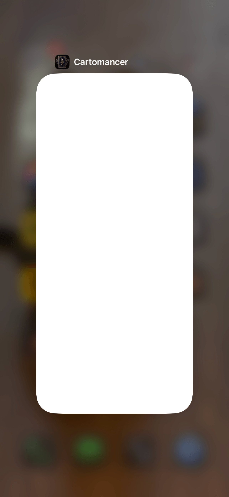
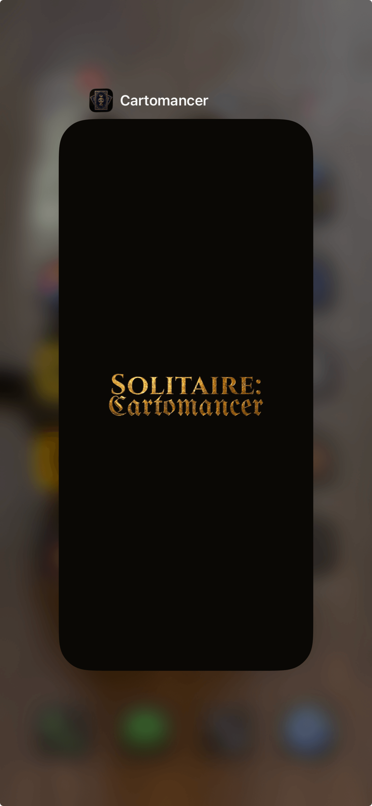

# Godot iOS App Switcher Cover

A tiny Godot 4 editor plugin that fixes the **blank white card** iOS shows for a Godot app in the app switcher (multitasking view), replacing it with your own image or color.

| Without the plugin | With the plugin |
|:---:|:---:|
|  |  |

> Built by [High Low Studios](https://github.com/high-low-studios) for **[Solitaire: Cartomancer](https://solitairecartomancer.app/)**.

## The problem

When iOS sends an app to the background it takes a snapshot of the app's **UIKit view hierarchy** to show in the app switcher. That snapshot **excludes GPU-backed layers** (OpenGL ES / Metal), and a Godot app renders everything into exactly such a layer. So the snapshot captures the empty window behind it: a **plain white card**, no matter what screen the user was on.

It's an iOS platform behavior, not a Godot bug, so it isn't going away in a future Godot release, and there's no project setting that fixes it.

## The fix

A small native overlay. When the app backgrounds, the plugin slips a full-screen view (your image, or a solid color) over the key window; when it returns to the foreground, it removes it. The app switcher then shows that view instead of white.

- Deliberately hooks **`applicationDidEnterBackground`** only, *not* `applicationWillResignActive`, which would flash the cover over your live app every time the user pulls Control Center or gets a notification.
- Falls back to a **solid color** (default black) if no image is set, so it's never accidentally white.

## Install

1. Copy `addons/ios_app_switcher_cover/` into your project's `addons/` folder.
2. Enable **iOS App Switcher Cover** in *Project → Project Settings → Plugins*.

(Or install via the Godot Asset Library once published.)

## Configure

The plugin adds three settings under *Project Settings → General → `ios_app_switcher_cover/`*:

| Setting | What it does | Default |
|---|---|---|
| `image` | A `res://` image (PNG/JPG) drawn over the window. Use a full-screen image (e.g. your boot splash / launch image) for best results. Leave empty for color only. | _(none)_ |
| `background_color` | Solid color behind the image, and the whole cover when no image is set. | black |
| `scale_mode` | `fill` (cover the screen, may crop) or `fit` (contain the image, centered on the color, ideal for a logo). | `fill` |

That's it. Export to iOS as usual. Configuration is written into `Info.plist` at export and read by the native code at runtime, so **you never recompile anything**.

> **Tip:** match `background_color` to your launch storyboard / boot-splash color so the app-switcher card, the launch screen, and the boot splash all read as one continuous moment.

## How it works

- The cover is native Objective-C++ (`addons/ios_app_switcher_cover/src/app_switcher_cover.mm`) compiled into a small static library (`bin/libAppSwitcherCover.a`).
- On iOS export, the editor plugin links the lib with `add_ios_project_static_lib()` and the **`-ObjC`** flag (required so the linker keeps the class and runs its `+load`), and writes your settings into `Info.plist`.
- The class registers `UIApplication` background/foreground observers at launch via `+load`, so no Godot-side calls are needed.

## Limitations

- **iOS only.** On Android the app switcher (Recents) captures the window *surface* directly and already shows your real last frame, so no cover is needed.
- **Physical devices (arm64).** The bundled library is a device slice. iOS **Simulator** builds will fail to link. Simulator support (a device + simulator `.xcframework`) is on the roadmap.
- Tested on **Godot 4.6**. The export API it uses is unchanged in 4.7, so it *should* work there too (not yet verified on a 4.7 build).
- Requires **iOS 13+** (uses the `UIScene` key-window lookup).

## Building the native library from source

Only needed if you change `src/app_switcher_cover.mm`. Requires a Mac with Xcode:

```bash
bash addons/ios_app_switcher_cover/build_ios_lib.sh
```

This compiles the `.mm` and writes `bin/libAppSwitcherCover.a`. Commit the result.

## License

MIT. See [LICENSE](LICENSE).
